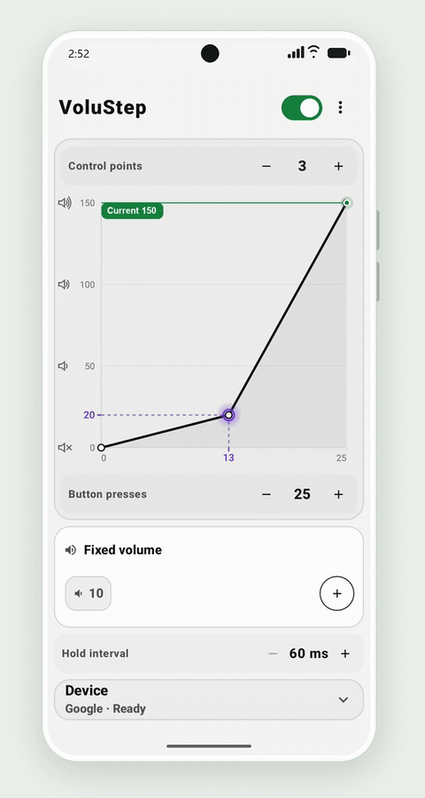

# VoluStep

[简体中文](README.md) | English

**Big volume jumps with every button press are a nightmare when you sleep with headphones on.**

VoluStep lets you customize how your Android phone's physical volume keys work. Use a custom curve to adjust how much each press changes the volume at different levels.

<p align="center">
  
</p>

## Features

- **Custom volume curve:** Drag control points to shape each volume change, and set the total number of presses independently.
- **Tap and hold:** Tap for one mapped step, or hold for continuous adjustment at your chosen interval.
- **Volume presets:** Save your favorite levels and apply them with a single tap in the app.

## Get started

Supports **Android 9 (API 28) and later**, with English and Simplified Chinese interfaces.

1. Download and install the APK from [Releases](https://github.com/SPCDTS/VoluStep/releases).
2. Open VoluStep, review and accept the permission disclosure, and enable its accessibility service in Android settings.
3. Return to the app, turn on the main switch, adjust your curve, and use the physical volume keys.

Use the main switch to start or stop key mapping. Volume presets work independently of key mapping and accessibility access.

## Device support and privacy

VoluStep remaps the volume levels already provided by Android and your connected device. Your device determines the quietest audible level and the available adjustment precision. Background and screen-off behavior varies by phone and firmware. See [Compatibility](docs/OEM_COMPATIBILITY.md).

VoluStep runs entirely on your device. Settings stay in local app storage, and the accessibility service processes volume-key events exclusively. See [Privacy](docs/PRIVACY.md).

<details>
<summary>Build from source and explore the documentation</summary>

Requires JDK 17, Android SDK 37, and Build Tools 37.

```bash
./gradlew :app:assembleDebug
```

The Debug APK is generated at `app/build/outputs/apk/debug/app-debug.apk`.

See [Toolchain setup](docs/TOOLCHAIN.md) for Windows instructions and the full build workflow.

[Architecture and curve design](docs/ARCHITECTURE.md) · [Testing](docs/TESTING.md)

</details>

## License

[MIT](LICENSE). Third-party dependencies retain their respective licenses.
